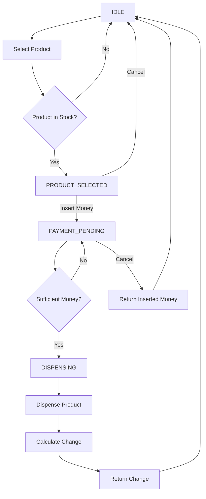

### Requirements

Design a vending machine that:

1. Sells multiple products.
2. Each product has:
   - Product ID
   - Name
   - Price
   - Quantity
3. User can select a product.
4. User inserts money.
5. Machine should check whether sufficient money was inserted.
6. If sufficient:
   - Dispense the product.
   - Return remaining change.
7. If insufficient:
   - Tell the user how much more is required.
8. User should be able to cancel the transaction and get their money back.
9. Machine should not dispense a product if it is out of stock.
10. Machine should maintain its current state.

### Example

```
User
 ↓
Select Coke (₹40)
 ↓
Insert ₹50
 ↓
Machine
 ├── Check stock
 ├── Check payment
 ├── Dispense Coke
 └── Return ₹10
```

### Basic Flow

```
              Vending Machine
                    │
             Select Product
                    ↓
             Insert Money
                    ↓
          Check Stock + Money
              /          \
           Enough       Not Enough
             ↓              ↓
         Dispense       Ask for more
             ↓
        Return Change
```


### Entities

1) Product(product id, product name, product qty, product rate/1pc)
2) VendingMachine(Array of products, Machine State , Transaction)
3) Transaction(selected ProductId, inserted amount)
4) Vending Machine Service( Logic handled here and all validations handled , Vending Machine)
5) MachineState(has enum states and that can be set)

### Relationship

```
                     User
                       │
                       ↓
             VendingMachineService
                       │
                       ↓
                VendingMachine
                /      |       \
               ↓       ↓        ↓
          Product[]  State   Transaction
                              │
                    ┌─────────┴─────────┐
                    ↓                   ↓
             Selected Product     Inserted Amount
```


### states




